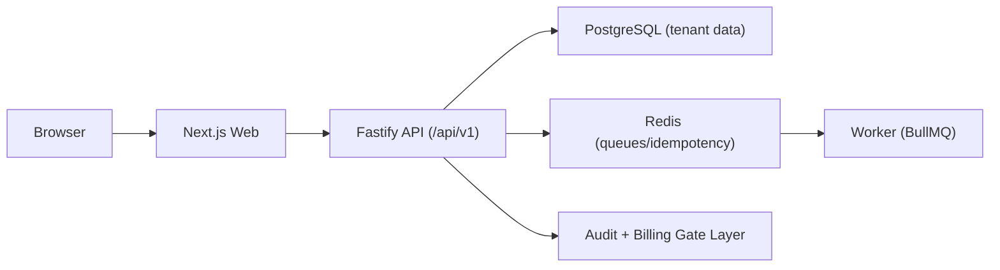

# Atlas

Production-style multi-tenant SaaS platform for B2B teams.

Atlas demonstrates how to build and operate a real product for multiple organizations:
tenant isolation, RBAC, billing feature gates, async workers, and production deployment.

## Live URLs

- App: [https://atlas.rollsev.work](https://atlas.rollsev.work)
- API: [https://api.atlas.rollsev.work/api/v1](https://api.atlas.rollsev.work/api/v1)

## Why This Project Exists

Most portfolio apps are single-tenant demos. Atlas focuses on real SaaS complexity:

- one codebase, many organizations (`tenant_id` isolation)
- roles and permissions (`OWNER`, `ADMIN`, `MANAGER`, `MEMBER`)
- plan limits and feature gates (`FREE`, `PRO`, `BUSINESS`)
- background processing with retries, idempotency, dead-letter handling
- deployable architecture (web + api + worker + postgres + redis)

## Monorepo

```text
apps/
  web/      Next.js (public + app UI)
  api/      Fastify + Prisma + PostgreSQL
  worker/   BullMQ + Redis jobs
packages/
  ui/       shared UI primitives
  config/   eslint/prettier/tsconfig presets
```

## Architecture



## Core Features

### Auth and Sessions

- register/login/logout
- refresh token rotation
- forgot/reset password
- session/device tracking
- brute-force protection baseline

### Tenancy and Permissions

- tenant resolution via `x-organization-id` header
- strict tenant-bound queries in all tenant endpoints
- membership model and invite/accept flow
- RBAC guard + policy layer for resource actions
- frontend permission mirroring (action availability by role)

### Domain Modules

- organizations, workspaces, clients, projects, tasks
- filtering, sorting, search, pagination
- optimistic concurrency for task updates (`expectedVersion`)
- audit logs for critical mutations

### Billing Architecture

- plans and subscriptions
- feature gates (`advanced_permissions`, `audit_logs`, etc.)
- usage limits (`projects`, `members`, `storage`)
- usage/invoice endpoints for billing UI

### Worker Reliability

- retry policy with backoff
- dead-letter queue for failed jobs
- idempotency key deduplication via Redis TTL
- structured job lifecycle logging

### Frontend UX

- public pages: landing, pricing, auth pages
- app shell with tenant switcher
- authenticated session bootstrap store
- loading/empty/error states across core pages
- table and board views with stateful filters/pagination

## API Highlights

### Auth

- `POST /api/v1/auth/register`
- `POST /api/v1/auth/login`
- `POST /api/v1/auth/refresh`
- `POST /api/v1/auth/logout`
- `POST /api/v1/auth/forgot-password`
- `POST /api/v1/auth/reset-password`

### Tenant and Organization

- `GET /api/v1/organizations`
- `POST /api/v1/organizations`
- `PATCH /api/v1/organizations/:id`
- `DELETE /api/v1/organizations/:id`
- `GET /api/v1/tenant/context`
- `GET /api/v1/tenant/members`
- `GET /api/v1/tenant/invitations`
- `POST /api/v1/tenant/invitations`
- `POST /api/v1/tenant/invitations/accept`

### Work Domain

- `GET/POST/PATCH/DELETE /api/v1/tenant/workspaces`
- `GET/POST/PATCH/DELETE /api/v1/tenant/clients`
- `GET/POST/PATCH/DELETE /api/v1/tenant/projects`
- `GET/POST/PATCH/DELETE /api/v1/tenant/tasks`
- `GET /api/v1/tenant/audit-logs` (feature-gated)

### Billing

- `GET /api/v1/tenant/billing/usage`
- `GET /api/v1/tenant/billing/invoices`

## Local Setup

1. Install dependencies:
   - `pnpm install`
2. Create env file:
   - `cp .env.example .env`
3. Start infrastructure:
   - `docker compose up -d`
4. Apply DB migration and seed:
   - `pnpm db:migrate`
   - `pnpm db:seed`
5. Start all apps:
   - `pnpm dev`

## Quality Gates

- `pnpm lint`
- `pnpm typecheck`
- `pnpm test`
- `pnpm format:check`

## Deployment

Railway services:

- `web`
- `api`
- `worker`
- `postgresql`
- `redis`

Custom domains:

- `atlas.rollsev.work` -> web
- `api.atlas.rollsev.work` -> api

## Current Status

Atlas is actively developed as an open-source portfolio SaaS.

Completed:

- multi-tenant foundation
- RBAC + policy guards
- organization/workspace/project/task/client CRUD
- worker reliability baseline
- production deployment baseline

Planned next:

- comments and attachments
- mock checkout + billing webhooks
- e2e flows and smoke suites
- observability dashboards and alert channel

## License

This project is licensed under the MIT License.
See [LICENSE](./LICENSE).
